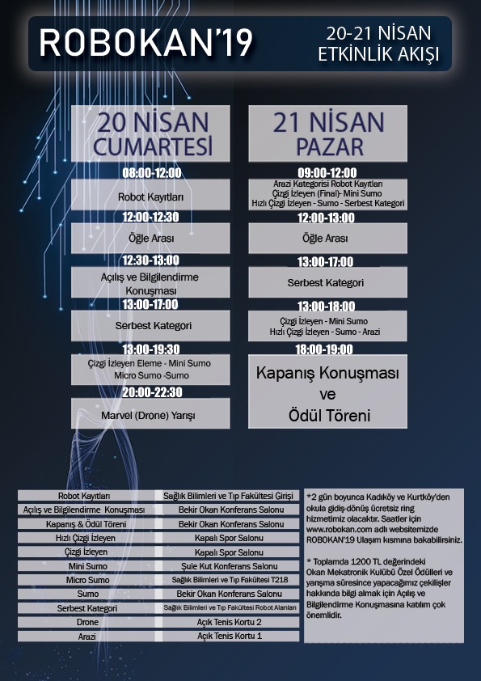

# Robokan '19 Etkinlik Takvimi

### 20 Nisan Cumartesi

| Saatler | Etkinlik | Konum |
----------------|----------|-------
| 08:00 - 12:00 | Robot Kayıtları | Sağlık Bilimleri ve Tıp Fakültesi Girişi |
| 12:00 - 12:30 | Öğle Arası |  |
| 12:30 - 13:00 | Açılış ve Bilgilendirme Konuşması | Bekir Okan Konferans Salonu |
| 13:00 - 17:00 | Serbest Kategori | Sağlık Bilimleri ve Tıp Fakültesi Robot Alanları |
| 13:00 - 19:30 | Çizgi İzleyen Eleme - Mini Sumo - Micro Sumo - Sumo | `Kategori alanlarına aşağıdan bakabilirsiniz` |

### 21 Nisan Cumartesi

| Saatler | Etkinlik | Konum |
----------------|----------|--------
| 09:00 - 12:00 | Arazi Kategorisi Robot Kayıtları - Çizgi İzleyen (Final) - Mini Sumo - Hızlı Çizgi İzleyen - Sumo - Serbest Kategori | Kategori alanlarına aşağıdan bakabilirsiniz` |
| 12:00 - 13:00 | Öğle Arası | - |
| 13:00 - 17:00 | Serbest Kategori | Sağlık Bilimleri ve Tıp Fakültesi Robot Alanları |
| 13:00 - 18:00 | Çizgi İzleyen - Mini Sumo - Hızlı Çizgi İzleyen - Sumo - Arazi | `Kategori alanlarına aşağıdan bakabilirsiniz` |
| 18:00 - 19:00 | Kapanış Konuşması ve Ödül Töreni | Bekir Okan Konferans Salonu |

--------

## Kategori Konumları

| Etkinlik | Konum |
-----------|-------
| Hızlı Çizgi İzleyen | Kapalı Spor Salonu |
| Çizgi İzleyen | Kapalı Spor Salonu |
| Mini Sumo | Şule Kut Konferans Salonu |
| Micro Sumo | Sağlık Bilimleri ve Tıp Fakültesi T218 |
| Sumo | Bekir Okan Konferans Salonu |
| Serbest | Sağlık Bilimleri ve Tıp Fakültesi Robot Alanları |
| Drone | Açık Tenis Kortu 2 |
| Arazi | Açık Tenis Kortu 1 |
