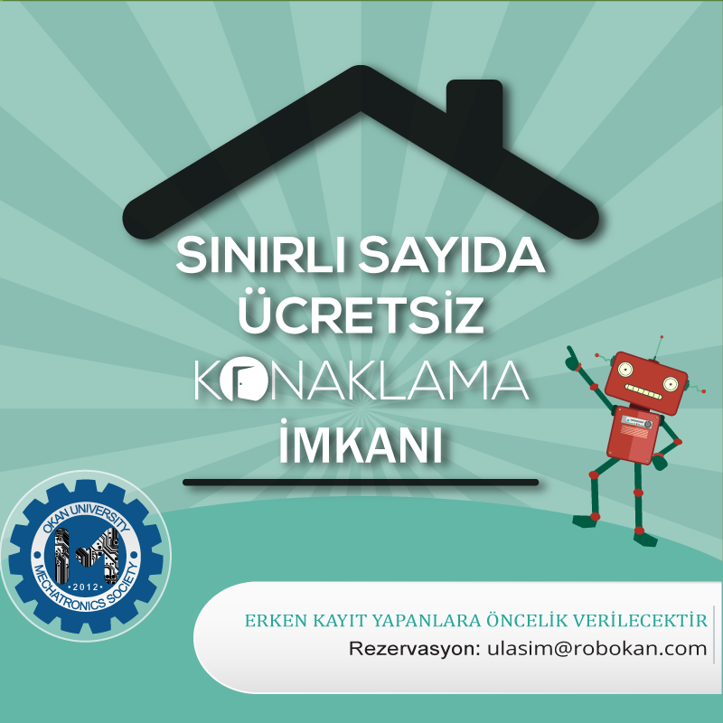

## Konaklama için ulasim@robokan.com adresine 
AD - SOYAD,	TC KİMLİK NO,KATILIMCI ÜNVANI(ÖĞRENCİ-ÖĞRETMEN),	CİNSİYET(K/E),	ŞEHİR,	OKUL ADI,	OKUL TÜRÜ,	TAKIM ADI BELİRTMESİ GEREKMEKTEDİR.

✔ Konaklamayı kendiniz ayarlamak isterseniz aşağıdaki yerleri arayabilirsiniz. 

  
  VILLA VANILLA HOTEL 
Adres: Esentepe Mah, Yıldız Cad No:9, 34870 Kartal/İstanbul 
Tel: 0 216 517 90 00- 0 216 517 90 90    
BLUE MARİNE HOTEL 
Adres:  Güzelyalı Mh. Yakut Sk. No:6 Pendik / İstanbul   
Tel: 0 216 392 11 36-37  
HAMPTON BY HILTON KURTKÖY 
Adres: YeniŞehir Mh. Millet Caddesi 27 MVK Work Square B Blok 3 Pendik, İstanbul 
Tel: +90 216 702 11 11  
NEARPORT HOTEL 
Adres: Yenişehir Mah. Osmanlı Bulvarı No 5/A Kurtköy Pendik İstanbul 
Tel: 0216 909 96 00  
TCDD HAYDARPAŞA MİSAFİRHANESİ 
Adres : Rıhtım Cad. Kadıköy Haydarpaşa Gar Binasının yanı.  İSTANBUL 
Tel : 0 216 336 26 85  
MARMARA ÜNİVERSİTESİ MİSAFİRHANESİ 
Adres : Marmara Üniversitesi Sosyal Tesisler Müdürlüğü Misafirhane ve Tesisleri, Marmara Üniversitesi Göztepe Kampüsü, Kuyubaşı-Kadıköy-İstanbul 
Tel : (0 216) 330 55 20 – 418 88 18 – 418 88 19   
TUZLA SEMİHA KİBAR UYGULAMA OTELİ 
Adres: Aydıntepe Mahallesi, Edebali Caddesi No:3. Tuzla – İstanbul 
Telefon: (0216) 507 2091  
SULTANBEYLİ ÖĞRETMEN LOKALİ 
Adres: Abdurahman Gazi Mh. Fatih Blv. Kosova Sk. No:5. Sultanbeyli – İSTANBUL 
Telefon: (216) 496 37  63 – (216)  496 1747   
ÜSKÜDAR ADİLE SULTAN KASRI KÜLTÜR MERKEZİ 
Adres: Tophanelioğlu Cd.No:39 Koşuyolu –İSTANBUL 
Telefon: (216) 325 64 44  
KADIKÖY VALİ EROL ÇAKIR ÖĞRETMEN EVİ 
Adres: Ataşehir Girişi. BP Benzin İstasyonu Arkası. Merdiven köy yolu N:1.Kadıköy-İSTANBUL  
Telefon: (216) 576 24 11 – 574 37 94  
KÜÇÜKYALI ÖĞRETMEN LOKALİ 
Adres: Kılavuzçayırı cd. No.1 Altıntepe/Maltepe – İSTANBUL 
Telefon: (216) 489 84 22-417 77 74 -366 26 94  
KADIKÖY KIZILTOPRAK ÖĞRETMENEVİ ASO 
Adres: Hasan Ahir Sk. No:14 Kızıltoprak – Kadıköy-İSTANBUL  
Telefon: (216) 418 24 11-338 24 11 – 345 24 11  
ÜMRANİYE ÖĞRETMENAVİ ASO 
Adres: Aşağı Dudullu Mh. Cami cd. No:32. Ümraniye-İSTANBUL  
Telefon: (216) 612 64 29 – 612 62 04  
EMEX OTEL İSTANBUL 
Adres: Kartal sahil yolu no:160 emex plaza kartal/İstanbul 
Tel: 0216 517 8293     
ARKEM 1 OTEL 
Adres: Fındıklı Mahallesi, Sarmaşık Sk. No:183, 34854 Maltepe/İstanbul 
Tel: 0216 576 61 90-0533 128 30 81  
GOLDEN DREAM OTEL 
Adres: Orta Mahallesi, Kanuni Sk. No:8, 34880 Kartal/İstanbul 
Tel: 0216 589 33 33- 0549 589 03 33  
ASYA PARK HOTEL 
Adres: Orhanlı Mahallesi, Demokrasi Cd. No:36, 34956 Tuzla/İstanbul  
Tel: 0216 394 47 41  
 
HILL SUITES RESIDENCE 
Adres: Şeyhli Mahallesi Akşemsettİn Caddesİ No:6 Pendik/İstanbul 
Tel: 0216 378 38 38

